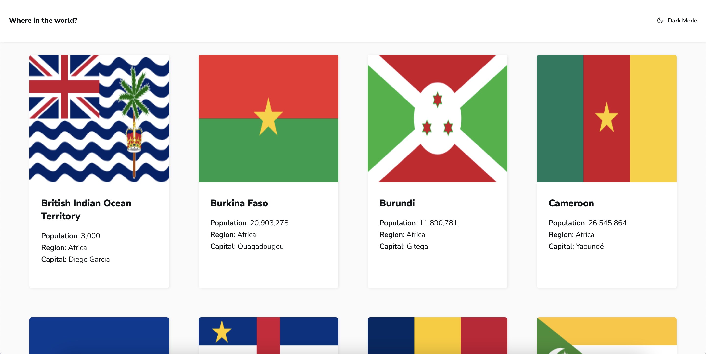

# Frontend Mentor - REST Countries API with color theme switcher solution

This is a solution to the [REST Countries API with color theme switcher challenge on Frontend Mentor](https://www.frontendmentor.io/challenges/rest-countries-api-with-color-theme-switcher-5cacc469fec04111f7b848ca). Frontend Mentor challenges help you improve your coding skills by building realistic projects. 

## Table of contents

- [Overview](#overview)
  - [The challenge](#the-challenge)
  - [Screenshot](#screenshot)
  - [Links](#links)
- [My process](#my-process)
  - [Built with](#built-with)
  - [Continued development](#continued-development)
  - [What I learned](#what-i-learned)

## Overview

### The challenge

Users should be able to:

- See all countries from the API on the homepage
- Search for a country using an `input` field
- Filter countries by region
- Click on a country to see more detailed information on a separate page
- Click through to the border countries on the detail page
- Toggle the color scheme between light and dark mode

### Screenshot

### Links

- Solution URL: [https://github.com/RickyReyes/countries](https://github.com/RickyReyes/countries)
- Live Site URL: [https://countries-ochre.vercel.app/](https://countries-ochre.vercel.app/)

## My process

### Built with

- Semantic HTML5 markup
- Sass variables, mixins, and nesting
- Flexbox
- CSS Grid
- Mobile-first workflow
- [Font Awesome](https://fontawesome.com) - icons
- Vanilla JavaScript
- [REST Countries](https://restcountries.com/) - RESTful API

## Continued development
- In the future, I would simplify the code with React. Each country can be a component, and the dark mode can exist in state.

## What I learned
### Fetching data from an RESTful API
- I learned how and when to use fetch, async, await, try, catch.
- I learned how to access an object's properties, and render them to the page in a succinct way by using the map() method and the join method.

### Implementing Dark Mode
- I created a boolean variable named "dark", and an array for all the elements that would change when dark mode is selected.
- I created a dark class for each element in the array, and toggled it when the Dark Mode link was clicked.

### Styling a `select` dropdown  
- I learned that the default styling in place for <select> dropdowns varies from browser to browser. It is not easy to style these dropdowns using CSS, and it is recommended to use JavaScript if one wished to change the default styling. 
